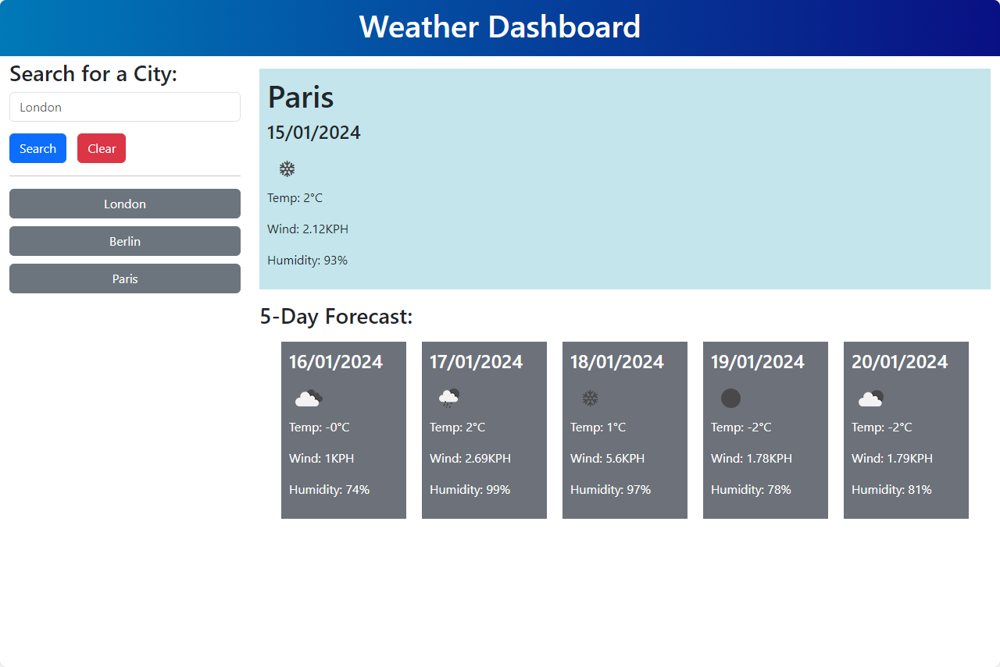

# Weather Dashboard

## Overview

This Weather Dashboard is a web application that allows users to retrieve and display current and future weather conditions for a specific city. The application utilizes the 5 Day Weather Forecast API from OpenWeatherMap to fetch weather data.




## Deployment

The deployed version can be accessed [here](https://borregaio.github.io/weather-app/).


## Tech Stack
- JavaScript
- jQuery
- Day.js
- Bootstrap
- OpenWeatherMap
- OpenCage


## Usage

### Search for a City:

1. Enter the desired city name in the search bar.
2. Click the search button.

### Current Weather Conditions:

- Displays the following information:
  - City name
  - Date
  - Icon representation of weather conditions
  - Temperature
  - Humidity
  - Wind speed

### 5-Day Forecast:

- Presents a 5-day forecast with details for each day:
  - Date
  - Icon representation of weather conditions
  - Temperature
  - Humidity

### Search History:

- The searched city is added to the search history.
- Clicking on a city in the search history displays its current and future weather conditions.

### Persistent Data:

- Utilizes `localStorage` to store search history data for a seamless experience across sessions.
- The search history is retained even when the user closes or refreshes the page.


## Getting Started

1. Clone the repository
    ```console
    git clone https://github.com/borregaio/weather-app.git
    ```

2. Open the index.html file in a web browser
    ```console
    cd weather-app
    open index.html
    ```


## Steps Followed

### Convert searched city to latitude/longitude with OpenCage and get weather data with OpenWeatherMap:
```javascript
// Fetch weather data function
function fetchWeatherData(searchValue) {
    // Convert city name to latitude/longitude
    const geocodingUrl = `https://api.opencagedata.com/geocode/v1/json?q=${encodeURIComponent(searchValue)}&key=${apiKeyOpenCage}`;

    fetch(geocodingUrl)
        .then(response => response.json())
        .then(data => {
            if (data.results && data.results.length > 0) {
                const cityComponent = data.results[0].components.city;

                if (cityComponent && cityComponent.toLowerCase() === searchValue.toLowerCase()) {
                    const location = data.results[0].geometry;
                    const latitude = location.lat;
                    const longitude = location.lng;

                    // Use latitude/longitude to fetch city weather
                    const weatherApiUrl = `https://api.openweathermap.org/data/2.5/forecast?lat=${latitude}&lon=${longitude}&appid=${apiKeyOpenWeather}`;

                    return fetch(weatherApiUrl);
                } else {
                    console.error('City not recognized by the geocoding service');
                }
            } else {
                console.error('Error getting coordinates for the city');
            }
        })
        .then(weatherResponse => weatherResponse.json())
        .then(weatherData => {
            displayWeatherData(searchValue, weatherData);
        })
        .catch(error => {
            console.error('Error:', error);
        });
}
```

### Get curret day with Day.js and display today's weather conditions:
```javascript
// Display today's weather function
function displayWeatherData(city, weatherData) {
    const today = dayjs();
    const todayInfo = $('#today').addClass('today').empty();

    const iconCode = weatherData.list[0].weather[0].icon;
    const iconUrl = `http://openweathermap.org/img/wn/${iconCode}.png`;

    const temperatureKelvin = weatherData.list[0].main.temp;
    const temperatureCelsius = (temperatureKelvin - 273.15).toFixed(0);

    const windCode = weatherData.list[0].wind.speed;

    const humidityCode = weatherData.list[0].main.humidity;

    todayInfo.append($('<h1>').text(city.charAt(0).toUpperCase() + city.slice(1)));
    todayInfo.append(' ');
    todayInfo.append($('<h4>').text(today.format('DD/MM/YYYY')));
    todayInfo.append(' ');
    todayInfo.append($('').attr('src', iconUrl));
    todayInfo.append($('<p>').text('Temp: ' + temperatureCelsius + '°C'));
    todayInfo.append($('<p>').text('Wind: ' + windCode + 'KPH'));
    todayInfo.append($('<p>').text('Humidity: ' + humidityCode + '%'));
```

### Display 5-Day Forecast:
```javascript
    // Display 5-day forecast
    const forecast = $('#forecast').empty();
    // Array with API index numbers for each day's information
    const indexArray = [7, 15, 23, 31, 39];

    forecast.append($('<h3>').text('5-Day Forecast:'));
    const container = $('<div>').addClass('container');
    const row = $('<div>').addClass('row justify-content-center');

    //Generate information divs for each day
    for (let i = 0; i < indexArray.length; i++) {
        const dayIndex = indexArray[i];
        const day = $('<div>').addClass('col-lg-2 col-sm-12 forecast');
        const dayh4 = $('<h4>');
        const dayDate = today.add(i + 1, 'day');
        const dayIcon = weatherData.list[dayIndex].weather[0].icon;
        const dayIconUrl = `http://openweathermap.org/img/wn/${dayIcon}.png`;
        const dayTemperatureKelvin = weatherData.list[dayIndex].main.temp;
        const dayTemperatureCelsius = (dayTemperatureKelvin - 273.15).toFixed(0);
        const dayWindCode = weatherData.list[dayIndex].wind.speed;
        const dayHumidityCode = weatherData.list[dayIndex].main.humidity;

        dayh4.text(dayDate.format('DD/MM/YYYY'));
        day.append(dayh4);
        day.append($('').attr('src', dayIconUrl));
        day.append($('<p>').text('Temp: ' + dayTemperatureCelsius + '°C'));
        day.append($('<p>').text('Wind: ' + dayWindCode + 'KPH'));
        day.append($('<p>').text('Humidity: ' + dayHumidityCode + '%'));
        row.append(day);
    }
```

### Generate new buttons on new search:
```javascript
// Search button click event
searchButton.on('click', function (event) {
    event.preventDefault();
    const searchValue = searchInput.val().trim();

    // Check if searchValue is not empty
    if (searchValue !== '') {
        if (!cityNames.includes(searchValue)) {
            console.log('Before fetchWeatherData:', searchValue);
            fetchWeatherData(searchValue);

            // Add new buttons everytime a city is entered on the search box
            const newButton = $('<button>').addClass('btn btn-secondary').text(searchValue.charAt(0).toUpperCase() + searchValue.slice(1));
            newButton.on('click', function () {
                const clickedCity = $(this).text();
                console.log('Before fetchWeatherData (from button click):', clickedCity);
                fetchWeatherData(clickedCity);
            });

            // Append the new button and update local storage with city
            cityHistory.append(newButton);
            cityNames.push(searchValue);
            localStorage.setItem('cityNames', JSON.stringify(cityNames));
            searchInput.val('');
        }
    }
});
```

### Display city history buttons on page load:
```javascript
// Get local storage information to generate history buttons on page load
function initializeCityButtons() {
    for (const cityName of cityNames) {
        const newButton = $('<button>').addClass('btn btn-secondary').text(cityName.charAt(0).toUpperCase() + cityName.slice(1));
        newButton.on('click', function () {
            const clickedCity = $(this).text();
            fetchWeatherData(clickedCity);
        });
        cityHistory.append(newButton);
    }
}

// Function to initialize city buttons when the page loads
initializeCityButtons();
```

### Clear history on button click:
```javascript
// Clear city history function
function clearCityHistory() {
    cityHistory.empty();
    localStorage.removeItem('cityNames');
    cityNames = [];
}

// Clear button click event 
clearButton.on('click', function (event) {
    event.preventDefault();
    clearCityHistory();
});
```